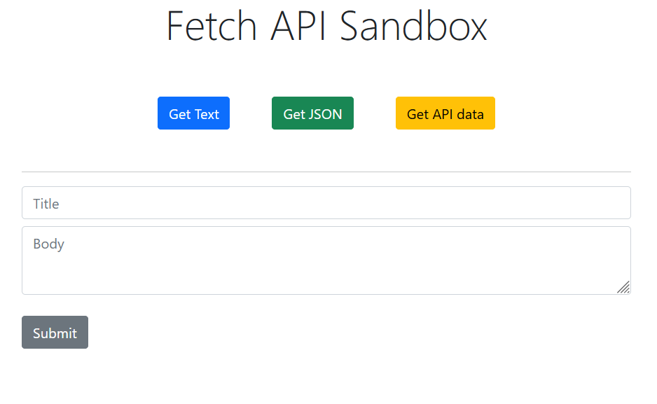
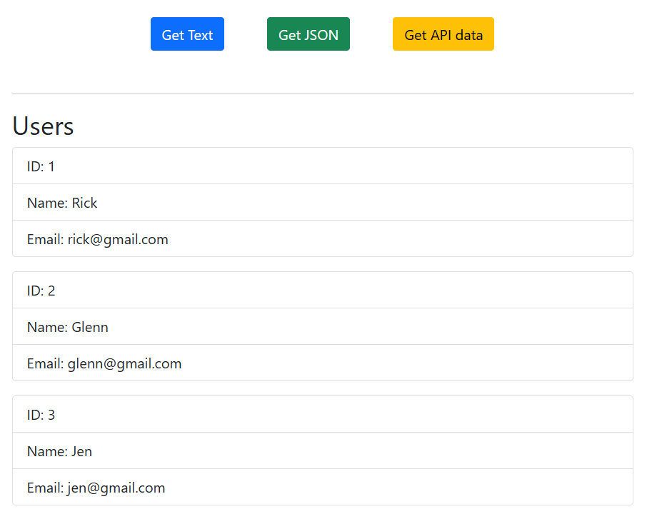
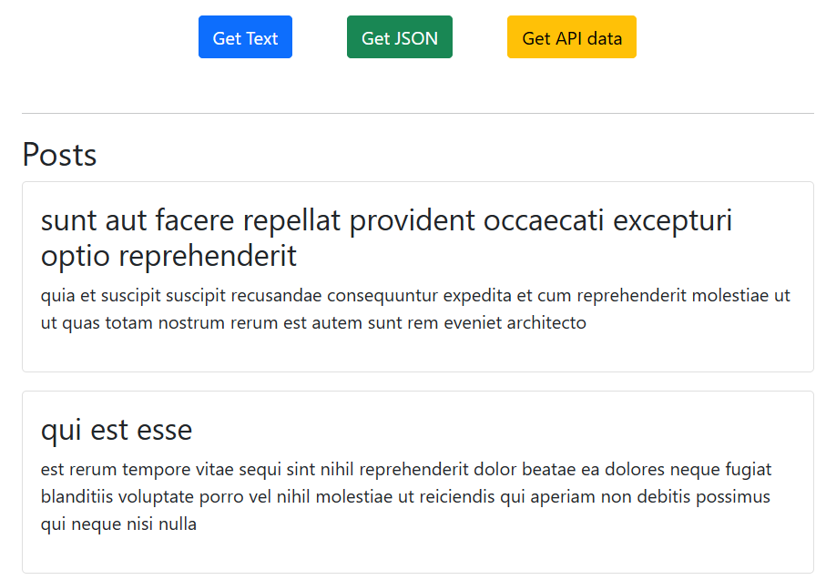

# Fetch-API-Sandbox

Fetch API Sandbox

<!-- Live link to deployed app -->

Repository: https://github.com/Mdudzik92/Fetch-API-Sandbox  
Deployed app: https://mdudzik92.github.io/Fetch-API-Sandbox/

<!-- Technologies used -->

HTML, Bootstrap, JavaScript, ES6, Fetch API, JSON

<!-- Explanation of what the app is -->

This is a simple sandbox app that fetches data from a text file asynchronously, from a local json file and from an external API. It also includes a bit of flexbox and Bootstrap to make it look nice.

<!-- Screenshot -->

<!-- License -->

MIT

<!-- Contact information -->

Email: mdudzik92@gmail.com
